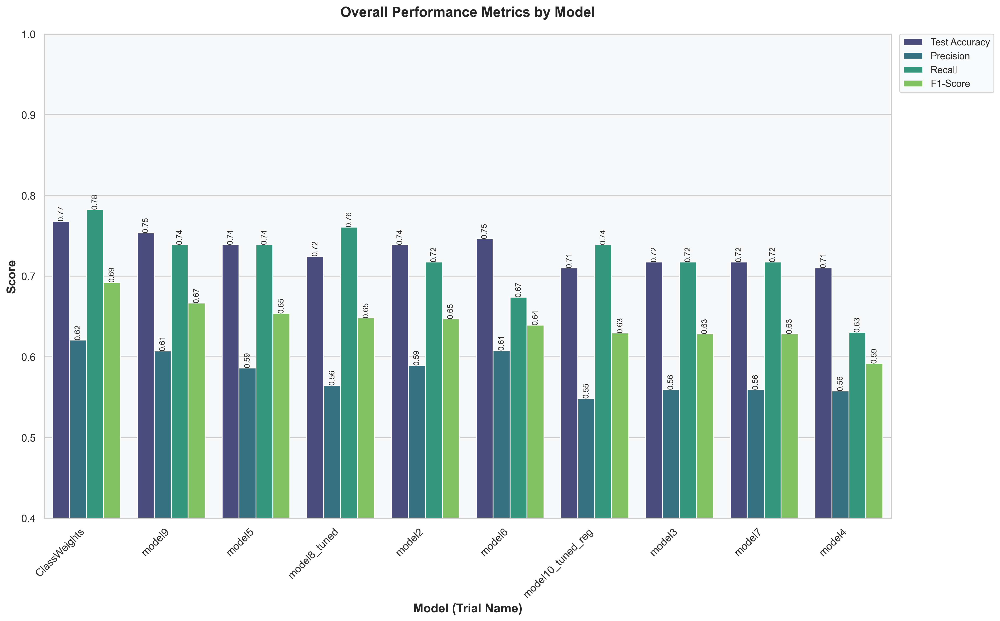
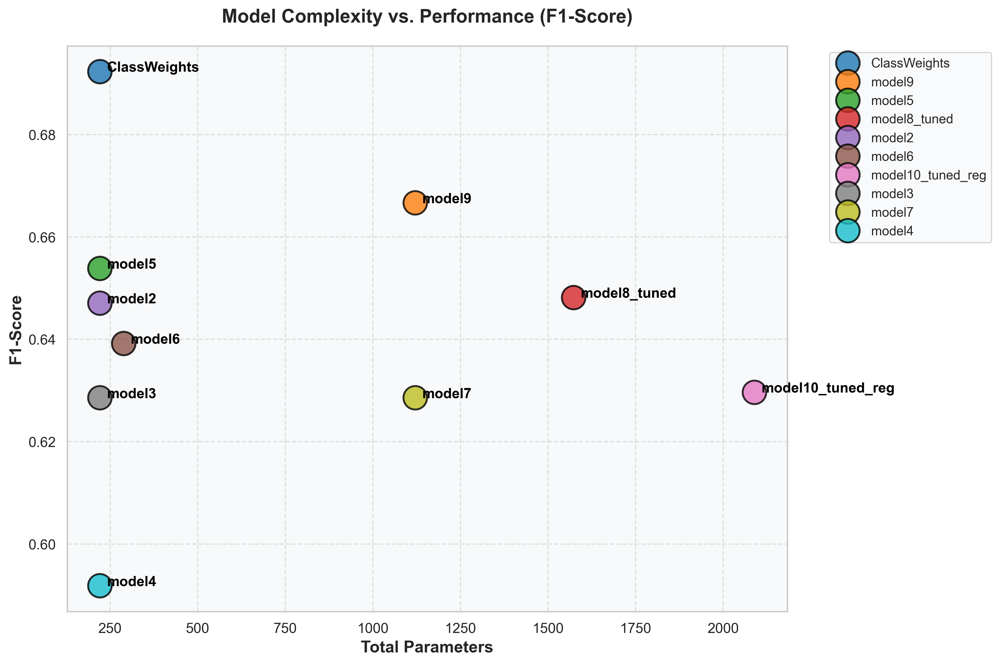
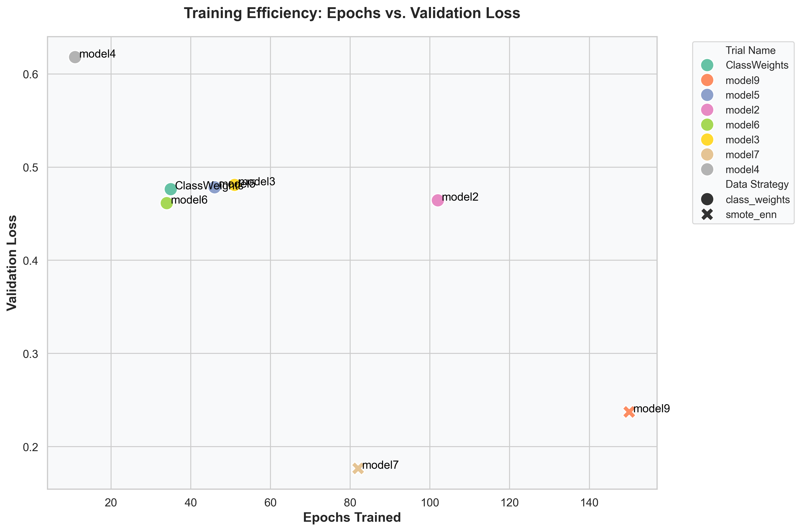

<h1 align="center">Neural Network for Diabetes Prediction</h1>

<p align="center">
  <strong>A deep learning approach to predicting diabetes onset using the Pima Indians Diabetes Database.</strong>
</p>

## Overview
This project focuses on building, evaluating, and tuning a deep neural network to predict the onset of diabetes based on diagnostic measures. The repository encompasses a comprehensive machine learning workflow, including data preprocessing, addressing class imbalance, performing hyperparameter tuning, model training, and rigorous performance tracking.

## Key Features
- **Deep Learning Architecture**: Custom neural network models constructed and trained using TensorFlow and Keras.
- **Hyperparameter Tuning**: Automated search for optimal network architectures, layers, and training parameters using Keras Tuner.
- **Imbalance Handling**: Integration of SMOTE (Synthetic Minority Over-sampling Technique) via `imbalanced-learn` to address target class imbalances.
- **Model Interpretability**: Implementation of SHAP (SHapley Additive exPlanations) values to interpret model predictions and feature importance.
- **Automated Experiment Tracking**: A dedicated custom tracking utility that systematically logs model configurations and metrics (Accuracy, Precision, Recall, F1-Score, AUC-ROC), while natively archiving trained model artifacts.

## Repository Structure
- `pima_diabetes_nn.ipynb`: The primary Jupyter Notebook containing the end-to-end analytical pipeline, from exploratory data analysis to final model evaluation.
- `diabetes.csv`: The source dataset containing diagnostic medical features and target outcome labels.
- `utils/trial_tracker.py`: A modular utility script to log trial metrics, capture model configurations, and persist model architectures.
- `requirements.txt`: A comprehensive list of dependencies required to seamlessly replicate the experimental environment.
- `trials_results.csv`: A historical, tabular log of all documented model trials and their respective detailed evaluation metrics.
- `saved_models/`: A directory where trained and serialized Keras models are securely stored for future inference.
- `tuner_results/`: A directory containing logs, state, and checkpoint files generated during the automated Keras Tuner search phase.
- `results/`: A directory containing generated performance plots, metric curves, and evaluation artifacts.

## Dataset
The dataset utilized is the recognized Pima Indians Diabetes Database. It incorporates several medical predictor variables (including Number of Pregnancies, BMI, Insulin level, Age, and Glucose) alongside a binary target variable representing the final diabetes diagnostic outcome.

## Installation
Ensure you have Python installed on your system. To set up the environment, clone this repository and install the listed dependencies:

```bash
git clone <repository_url>
cd neural-network-diabetes
pip install -r requirements.txt
```

## Usage Workflow
1. **Explore the Notebook**: Launch `pima_diabetes_nn.ipynb` using Jupyter Notebook, JupyterLab, or VSCode.
2. **Execute the Pipeline**: Progressively run the cells to preprocess the raw data, establish a baseline model, and deploy the hyperparameter tuning search.
3. **Track Experiments**: As models iteratively compile and train, the `trial_tracker.py` utility will independently append performance metrics to `trials_results.csv`.
4. **Analyze Results**: Review the generated SHAP summary plots, cost analyses, and core statistical evaluation metrics to determine the best performing architecture suitable for deployment.

## Model Comparison Insights

### Best Overall Model
- **Name:** ClassWeights
- **F1-Score:** 0.6923
- **Accuracy:** 0.7681
- **Strategy:** class_weights
- **Why it is the best:** Achieved the highest balance between Precision and Recall (F1-Score), making it the most reliable model for predicting both positive and negative diabetes cases.

### Most Efficient Model (Performance per Parameter)
- **Name:** ClassWeights
- **F1-Score:** 0.6923
- **Parameters:** 221
- **Why it is notable:** This model punches above its weight. It achieves strong performance with a very lightweight architecture, reducing inference time and overfitting risks.

### Best Model for Screening (Highest Recall)
- **Name:** ClassWeights
- **Recall:** 0.7826
- **F1-Score:** 0.6923
- **Why it matters:** In medical settings, failing to identify a diabetic patient (False Negative) is often more dangerous than a False Positive. This model minimizes False Negatives best.

### Data Strategy Analysis
- **class_weights:** Average F1-Score = 0.6421
- **smote_enn:** Average F1-Score = 0.6433
- **Conclusion:** The `smote_enn` strategy generally yields the best F1-Scores across architectures.

## Visualizations

### Overall Performance Metrics by Model


### Model Complexity vs. Performance


### Training Efficiency


## Dependencies
- `numpy`
- `pandas`
- `scikit-learn`
- `tensorflow`
- `matplotlib`
- `seaborn`
- `imbalanced-learn`
- `keras-tuner`
- `shap`
